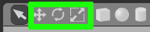

Программный комплекс Gazebo разделен на два отдельных компонента:

1. Сервер производит генерацию данных датчиков, вычисляет состояние объектов с помощью физического движка, предоставляет сервисы для управления состоянием, как процесса моделирования, так и отдельных объектов, их частей. Для запуска сервера используется команда `gzserver` с указанием пути к сцене в качестве параметра. Вместе с Gazebo поставляется библиотека со стандартными сценами и объектами.

2. Клиент отвечает за графический пользовательский интерфейс, основанный на QT. Для его запуска используется команда `gzclient`, в результате выполнения которой откроется окно, отражающее процессы, происходящие в сервере. Интерфейс прост в освоении, но предоставляет неполный набор доступных функций. Полноценное использование функционала программного комплекса предполагает частое взаимодействие с консолью и текстовым редактором.

## Создание сцены в Gazebo

Сцена в Gazebo представляет собой набор объектов: роботов, зданий, предметов. Также она хранит информацию о физических свойствах, движке, освещении и прочем.

Для того чтобы запустить клиент и сервер с пустой сценой, нужно открыть терминал и ввести команду `gazebo`.


Для добавление нового объекта предусмотрено два способа:

1. Простые объекты: куб, цилиндр, сфера, - могут быть добавлены с помощью панели инструментов.

   

   Примеры:

   

   Объекты могут быть увеличены в размерах, повернуты или перемещены:

   

   Пример:

   

2. Сложные объекты могут быть добавлены на сцену из онлайн библиотеки. Для этого нужно перейти во вкладку `Insert` и перетащить объект с нужным названием.

   

После того, как сцена была составлена, она может быть сохранена через меню: _File -> Save scene_. Сцена сохраняется в XML-подобном формате SDF (Simulation Description Language). Для того, чтобы было проще отличить файлы модели объекта от сцен, принято сохранять сцены с расширением **.world**.

## Запуск сцены

В качестве обучающего примера была собрана сцена `example.world` с различными препятствиями и целевым объектом в конце коридора.


Для ее запуска необходимо убедиться в наличии пакета `scene` и выполнить:

1. Открыть новый терминал и запустить ROS Master командой `roscore`.

2. Открыть новый терминал и выполнить:

   ```
   source devel/setup.bash
   roslaunch scene scene.launch
   ```

Также пакет упрощает запуск собственных сцен вместе с сервером и клиентом Gazebo:

1. Сохраните сцену в **scene/worlds**.

2. Выполните команду `roslaunch scene scene.launch world:=name` с названием нужной сцены в качестве аргумента.
