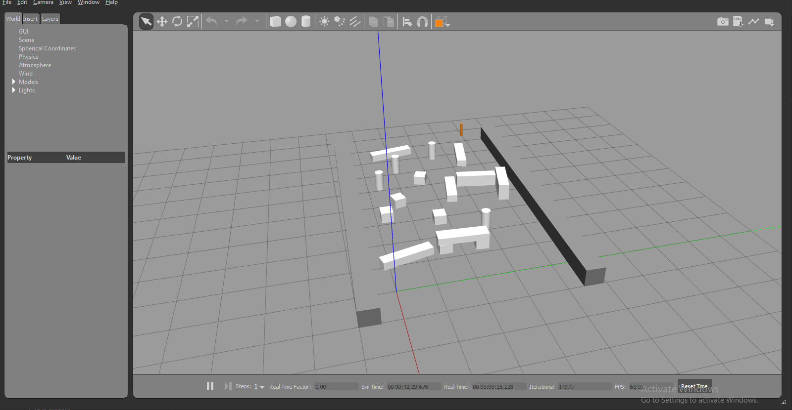
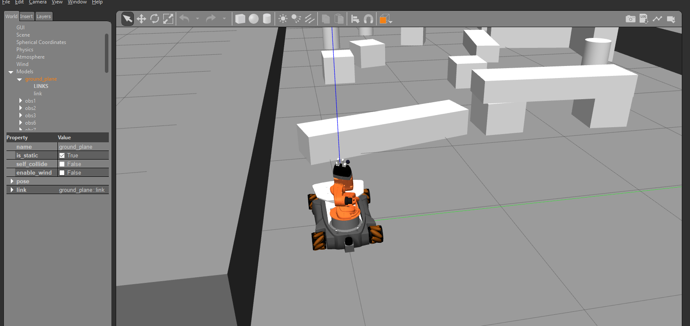

[Моделирование в Gazebo](#Моделирование-в-Gazebo)

[Описание пакетов](#Описание-пакетов)

[Интеграция модели KUKA youBot](#Интеграция-модели-KUKA-youBot)

- [Подготовка рабочего пространства](#Подготовка-рабочего-пространства)
- [Запуск модели](#Запуск-модели)
- [Сценарии использования](#Сценарии-использования)

# Моделирование в Gazebo

В моделировании участвуют следующие сущности:

1. Звенья отражают объекты с определёнными физическими свойствами: визуальной моделью, инерцией, моделью столкновений, излучаемым светом. Модель столкновений, как правило, выражают через более простую форму, чем визуальную, чтобы сэкономить требуемые вычислительные ресурсы. Форма может быть представлена в виде простейших фигур или облака точек.

2. Шарниры соединяют звенья. Они отражают взаимосвязь между родительским и дочерним элементами: тип связи, ось, предельные значения, силу трения. Поддерживаются следующие типы связей: вращательная, поступательная, фиксированная и другие.

3. Плагины определяют поведение – сторонние библиотеки, контролирующие модель, подключаемые прямо в её описании.

Среда Gazebo поддерживает два XML-подобных формата моделей. SDF (Simulation Description Language) – формат, непосредственно используемый Gazebo. URDF (Unified Robotic Description Language) – формат для моделирования роботов, используемый ROS. Для корректной работы URDF в Gazebo необходимо использовать дополнительные, специальные теги, благодаря которым модели в реальном времени могут быть конвертированными в SDF.

К значительным отличиям URDF от SDF относятся: использование относительных координат для установки положений, отсутствие поддержки параллельных связей, а также многих тегов, необходимых для моделирования произвольных физических объектов.

Для облегчения создания и изменения моделей, основанных на XML, существует язык Xacro (XML Macros) и одноимённый пакет для ROS, помогающий конструировать описание модели программно во время запуска launch-файла.

Возможности, открывающиеся при использовании Xacro:

- декомпозиция модели на составные части;
- повторное использование компонентов;
- вынесение числовых или строковых значений в отдельные константы или свойства, заполняемые с помощью терминала непосредственно при запуске;

# Описание пакетов


- **robust_youbot_description** - содержит описание модели робота KUKA youBot в формате SDF.

  При необходимости в папку **sdf** можно поместить модели робота с новыми модификациями.

- **youbot_description** - содержит вспомогательное описание модели в формате XACRO URDF, необходимое для генерации контроллеров.

- **youbot_gazebo_control** - включает файлы конфигурации контроллеров робота, а также их запуска.

  В папке **config** содержатся yaml-файлы конфигурации для руки, схвата и колес. С помощью них можно без повторной компиляции изменить параметры контроллеров, в частности коэффициенты ПИД-регуляторов.

- **youbot_gazebo_robot** - на основе других пакетов производит генерацию модели робота и помещает ее на сцену.

  В файле **youbot.launch** можно изменить стандартные значения параметров запуска:

  - **robot** - имя SDF-модели из пакета **robust_youbot_description**;

  - **init_x** - начальное положение робота по оси X;

  - **init_y** - начальное положение робота по оси Y;

  - **init_z** - начальное положение робота по оси Z;

# Интеграция модели KUKA youBot

## Подготовка рабочего пространства

1. Создать рабочее пространство. Для пространства с именем **catkin_ws** в терминале выполнить:

   ```
   mkdir -p ~/catkin_ws/src
   cd ~/catkin_ws/
   catkin_make
   ```

   Если рабочее пространство уже существует, то в терминале достаточно перейти в соответствующую директорию:

   `cd ~/catkin_ws/`

2. В файловом менеджере открыть папку **~/catkin_ws/src**, которая предназначена для исходного кода. Скопировать в неё папки **youbot** и **scene**, содержащие пакеты для работы с моделью робота и сценой, а также вспомогательный пакет **xacro**.

3. Провести сборку пакетов командой `catkin_make` в открытом ранее терминале.

## Запуск модели

1. Открыть новый терминал и запустить ROS Master командой `roscore`.

2. Открыть новый терминал и запустить сцену:

   ```
   source devel/setup.bash
   roslaunch scene scene.launch
   ```

   

3. Открыть новый терминал и поместить на сцену управляемую модель робота:

   ```
   source devel/setup.bash
   roslaunch youbot_gazebo_robot youbot.launch
   ```

   

## Сценарии использования

### Управление через графический интерфейс

1. Запустить утилиту **rqt** одноимённой командой `rqt`. Она является набором GUI для анализа и контроля ROS-систем.

2. Открыть панель управления направлением движения:

   _Plugins -> Robot Tools -> Robot Steering_

   

   Ползунки на панели управления позволяют регулировать линейную и вращательную скорость робота.

   

3. Открыть панель управления манипулятором:

   _Plugins -> Robot Tools -> Joint Trajectory Controller_

   Нажатием по красной кнопке включить отправку целевой точки. Для каждой оси обобщённая координата изменяется своим ползунком.

   

4. Открыть панель визуализации камеры:

   _Plugins -> Visualization... -> Image View_

   

Для эффективного использования программы удобно оставлять несколько панелей одновременно открытыми.

### Программное управление

1. Использовать топик `/cmd_vel` для управления направлением движения.

2. Использовать топик `/arm_1/arm_controller/command` для отправки команд манипулятору.
