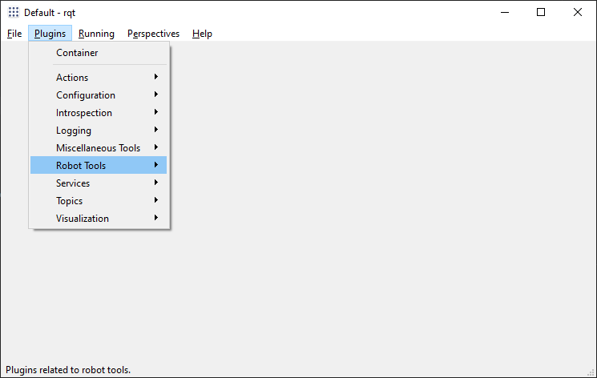

# Интеграция модели KUKA youBot

## Подготовка рабочего пространства

1. Создать рабочее пространство. Для пространства с именем **catkin_ws** в терминале выполнить:

   ```
   mkdir -p ~/catkin_ws/src
   cd ~/catkin_ws/
   catkin_make
   ```

   Если рабочее пространство уже существует, то в терминале достаточно перейти в соответствующую директорию:

   `cd ~/catkin_ws/`

2. В файловом менеджере открыть папку **~/catkin_ws/src**, которая предназначена для исходного кода. Скопировать в неё папки **youbot** и **scene**, содержащие пакеты для работы с моделью робота и сценой, а также вспомогательный пакет **xacro**.

3. Провести сборку пакетов командой `catkin_make` в открытом ранее терминале.

## Запуск модели

1. Открыть новый терминал и запустить ROS Master командой `roscore`.

2. Открыть новый терминал и запустить сцену:

   ```
   source devel/setup.bash
   roslaunch scene scene.launch
   ```

   

3. Открыть новый терминал и поместить на сцену управляемую модель робота:

   ```
   source devel/setup.bash
   roslaunch youbot_gazebo_robot youbot.launch
   ```

   

## Сценарии использования

### Управление через графический интерфейс

1. Запустить утилиту **rqt** одноимённой командой `rqt`.

2. Открыть панель управления направлением движения:

   _Plugins -> Robot Tools -> Robot Steering_

   

   Ползунки на панели управления позволяют регулировать линейную и вращательную скорость робота.

   

3. Открыть панель управления манипулятором:

   _Plugins -> Robot Tools -> Joint Trajectory Controller_

   Нажатием по красной кнопке включить отправку целевой точки.Для каждой оси обобщённая координата настраивается своим ползунком.

   

4. Открыть панель визуализации камеры:

   _Plugins -> Visualization... -> Image View_

   

### Программное управление

1. Использовать топик `/cmd_vel` для управления направлением движения.

2. Использовать топик `/arm_1/arm_controller/command` для отправки команд манипулятору.

# Описание пакетов


- **robust_youbot_description** - содержит описание модели робота KUKA youBot в формате SDF.

  При необходимости в папку **sdf** можно поместить модели робота с новыми модификациями.

- **youbot_description** - содержит вспомогательное описание модели в формате XACRO URDF, необходимое для генерации контроллеров.

- **youbot_gazebo_control** - включает файлы конфигурации контроллеров робота, а также их запуска.

  В папке **config** содержатся yaml-файлы конфигурации для руки, схвата и колес. С помощью них можно без повторной компиляции изменить параметры контроллеров, в частности коэффициенты ПИД-регуляторов.

- **youbot_gazebo_robot** - на основе других пакетов производит генерацию модели робота.

  В файле **youbot.launch** можно изменить стандартные значения параметров запуска:

  - **robot** - имя SDF-модели из пакета **robust_youbot_description**;

  - **robust_youbot_description**;

  - **init_x** - начальное положение робота по оси X;

  - **init_y** - начальное положение робота по оси Y;

  - **init_z** - начальное положение робота по оси Z;
